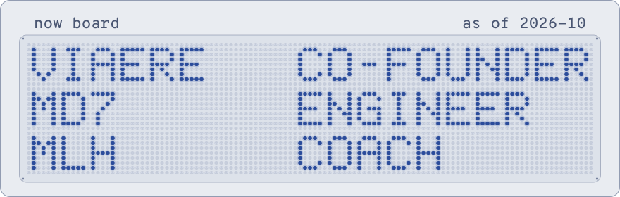
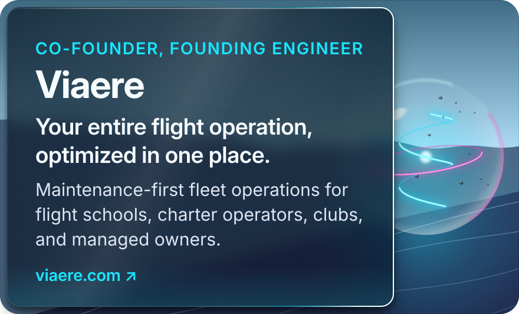
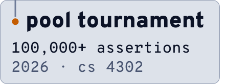
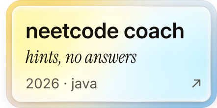
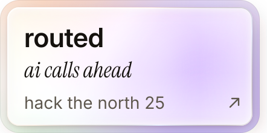
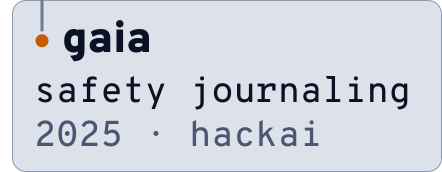
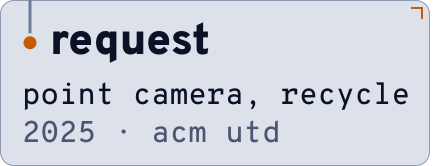
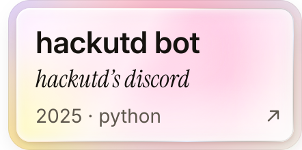
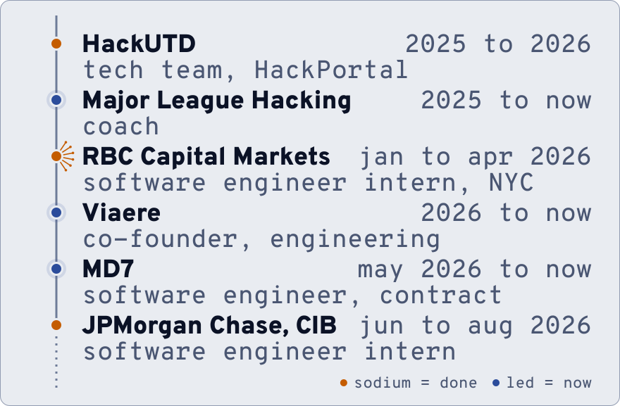

<a href="https://ayroescobar.com">
  <picture>
    <source media="(prefers-color-scheme: dark)" srcset="assets/hero-dark.svg">
    <source media="(prefers-color-scheme: light)" srcset="assets/hero-light.svg">
    
  </picture>
</a>

I am twenty years old, out of Plano, Texas. I am trying to build a life where my family never has to worry about money, and ship a few things that outlast me along the way. That sentence is the whole map. Every role I take and every hour I spend gets weighed against it.

## now

<a href="#now">
  <picture>
    <source media="(prefers-color-scheme: dark)" srcset="assets/now-dark.svg">
    <source media="(prefers-color-scheme: light)" srcset="assets/now-light.svg">
    
  </picture>
</a>

- **Viaere** · Co-founder, Engineering. I build the product end to end, ship every release, and answer the phone. Built beside the hangar floor with Garrett Taylor (maintenance) and Dylan Badowski (flight operations). [viaere.com](https://viaere.com)
- **MD7** · Software Engineer (contract), since May 2026. Executive dashboards that replace Power BI, shipped directly with the CTO, with real ownership over architecture and ship cadence.
- **Major League Hacking** · Coach, since 2025. Hackathons, Global Hack Week streams, and a weekly CSV to Google Sheet automation the team ran. Spoke at Hackcon 2026 ("Planning for Chaos").
- **UT Dallas** · B.S. Computer Science, in progress. AWS Certified Cloud Practitioner.

<a href="https://viaere.com">
  <picture>
    <source media="(prefers-color-scheme: dark)" srcset="assets/ventures/viaere-dark.svg">
    <source media="(prefers-color-scheme: light)" srcset="assets/ventures/viaere-light.svg">
    
  </picture>
</a>

## built

<a href="https://github.com/AyroEscobar/pool-tournament-system"><picture><source media="(prefers-color-scheme: dark)" srcset="assets/projects/pool-tournament-system-dark.svg"><source media="(prefers-color-scheme: light)" srcset="assets/projects/pool-tournament-system-light.svg"></picture></a><a href="https://github.com/AyroEscobar/neetcode-coach"><picture><source media="(prefers-color-scheme: dark)" srcset="assets/projects/neetcode-coach-dark.svg"><source media="(prefers-color-scheme: light)" srcset="assets/projects/neetcode-coach-light.svg"></picture></a> 
<a href="https://github.com/AyroEscobar/HTN2025"><picture><source media="(prefers-color-scheme: dark)" srcset="assets/projects/routed-dark.svg"><source media="(prefers-color-scheme: light)" srcset="assets/projects/routed-light.svg"></picture></a><a href="https://github.com/AyroEscobar/HackAI2025"><picture><source media="(prefers-color-scheme: dark)" srcset="assets/projects/gaia-dark.svg"><source media="(prefers-color-scheme: light)" srcset="assets/projects/gaia-light.svg"></picture></a> 
<a href="https://github.com/acm-projects/ReQuest"><picture><source media="(prefers-color-scheme: dark)" srcset="assets/projects/request-dark.svg"><source media="(prefers-color-scheme: light)" srcset="assets/projects/request-light.svg"></picture></a><a href="https://github.com/AyroEscobar/HackUTDDiscordBot"><picture><source media="(prefers-color-scheme: dark)" srcset="assets/projects/hackutd-bot-dark.svg"><source media="(prefers-color-scheme: light)" srcset="assets/projects/hackutd-bot-light.svg"></picture></a>

what each one is

- **pool tournament scheduler** · A single-file web app that schedules and simulates an eight-ball tournament. Circle-method round robin framed as a one-factorization of K_n with a live verification panel, Elo-driven match simulation, seeded single or double elimination, an 18-step guided walkthrough, and just over 100,000 assertions run against the exact algorithm block that ships. Built for CS 4302.
- **neetcode coach** · A Socratic NeetCode 150 coach in Java that runs inside Claude Code. It escalates hints in levels and never writes the solution.
- **routed** · Hack the North 2025, with a HackUTD team. A trip planner that pairs recommendations with action: routes by food and activities, reservations through partner sites, and a voice AI that calls ahead. Next.js, Firebase, Google Maps API, Cua with the Anthropic API.
- **gaia** · HackAI 2025, with a team. An AI journaling app for women in unsafe relationships that tracks emotional change over time and gives a safety read informed by DSM-5 criteria. React, Node, MongoDB.
- **ReQuest** · ACM UTD Projects, with a team. Point your camera at an item and it tells you where to recycle, sell, donate or dispose of it, with crowdsourced locations and geolocation search. React Native, OpenAI API, Firebase.
- **hackutd bot** · A Python bot for HackUTD's Discord servers.

Two more off the cards: [Interview-Lens](https://interview-lens.com) ([code](https://github.com/AyroEscobar/3354-Team1-InterviewLens)), an AI mock interview coach I built with a team (STAR-format behavioral rounds with live speech recognition, and a dashboard that scores pace, filler words and structure), and a personal multi-agent system I built on a Mac mini to watch my finances, track my health, curate news, file notes and write my morning briefing. Built on Claude, private code.

## route

<a href="https://ayroescobar.com">
  <picture>
    <source media="(prefers-color-scheme: dark)" srcset="assets/route-dark.svg">
    <source media="(prefers-color-scheme: light)" srcset="assets/route-light.svg">
    
  </picture>
</a>

- **RBC Capital Markets, New York** · Software Engineer Intern, January to April 2026. Inaugural AidenEdge cohort, one of ten interns, six trading-floor desks in four months. That door opened at Hack the North, where someone from RBC saw something in me.
- **JPMorgan Chase, CIB** · Software Engineer Intern, Plano, June to August 2026. Real work, a team that pushed me when I needed it, and more learned in one summer than I expected.

the six desks

- **Rates Trading and FX Algorithms** · An AI code review agent trained on 4,000+ pull request comments from the desk's two strongest engineers. It runs as a first pass before human review.
- **Rates Trading** · A trade compression tool that breaks compression swaps down into their underlying risks.
- **Quantitative Investment Strategies** (with Digital and AI Innovation) · An autonomous multi-agent platform that parallelizes research, analysis and report generation across 60+ quant strategies, cutting processing from 2 hours to 10 minutes per strategy. Integrated into RBC's internal systems.
- **AI and Digital Innovation** · Audited 4,700+ internal AI agents into 12 centralized workflows, surfacing a 70% redundancy rate and trimming prompt logic to cut token waste.
- **Cross-Asset Sales** · An AI editorial QA agent for the desk's flagship research brief, a global markets digest read by 1,500+ employees including executives. It reviews every issue before it sends.
- **Alternative Asset Group** · An automated SEC filing pipeline that pulls 20 credit reports in 5 minutes, down from about an hour, comparing N-CSR and 13F filings into structured storage.

## community

- **HackUTD** · Tech team, 2025 to 2026. Co-maintained HackPortal, the registration, check-in and live-judging platform, and helped run HackUTD 2025 end to end. HackUTD calls itself North America's largest 24-hour hackathon, 1,200+ participants.
- **ACM UTD** · Technical Interview Prep Officer, 2025. Led Java data structures and algorithms prep for a cohort, arrays through dynamic programming, plus mock interviews with personal feedback.
- Competed at HackAI 2025, Hack the North 2025 and Hack the North 2026.

## stack

Java (my strongest and my interview language), TypeScript, JavaScript, Python, C++, SQL\
React, Next.js, Node.js, Spring Boot, Tailwind, React Native and Expo\
AWS, PostgreSQL, Supabase, Firebase, MongoDB, Kafka, GraphQL, Vercel, Git\
AI agents and multi-agent systems, on trading desks and in my own life. Claude Code, daily.

## contact

Building something, stuck on something hard, or just want to trade ideas? My inbox is open and I move fast. I am always down to meet people who build.

<samp>
<a href="https://ayroescobar.com">ayroescobar.com</a> &nbsp;·&nbsp; <a href="mailto:ayro.escobar@gmail.com">ayro.escobar@gmail.com</a> &nbsp;·&nbsp; <a href="https://www.linkedin.com/in/ayroescobar">linkedin</a> &nbsp;·&nbsp; <a href="https://www.instagram.com/ayro.afk">instagram</a>
</samp>

<a href=".github/workflows/render.yml">
  <picture>
    <source media="(prefers-color-scheme: dark)" srcset="https://raw.githubusercontent.com/AyroEscobar/AyroEscobar/output/pulse-dark.svg">
    <source media="(prefers-color-scheme: light)" srcset="https://raw.githubusercontent.com/AyroEscobar/AyroEscobar/output/pulse-light.svg">
    
  </picture>
</a>

The cost of doing the work is doing the work. There is no shortcut. Panels drawn by <a href="scripts/build-assets.mjs">scripts/build-assets.mjs</a>; the pulse is rebuilt daily by <a href=".github/workflows/render.yml">render.yml</a>.

