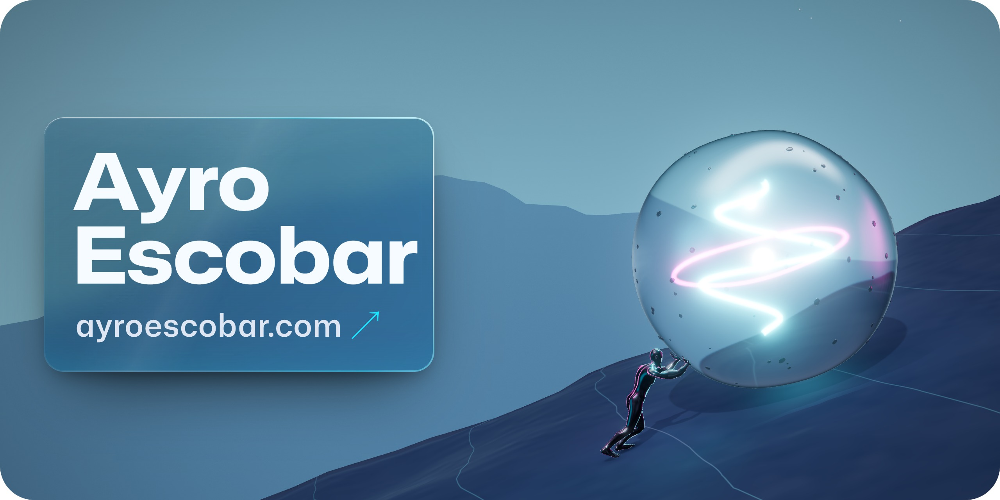
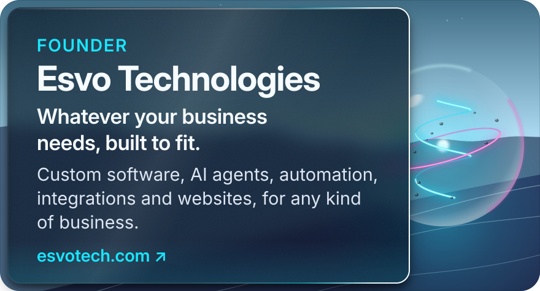
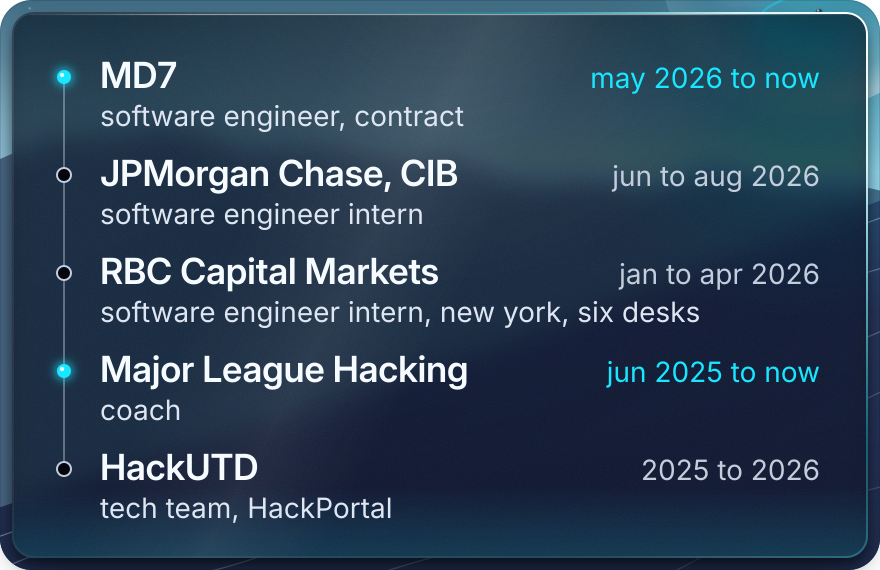

<a href="https://ayroescobar.com">
  <picture>
    <source media="(prefers-color-scheme: dark)" srcset="assets/hero-dark.jpg">
    <source media="(prefers-color-scheme: light)" srcset="assets/hero-light.jpg">
    
  </picture>
</a>

Software engineer out of Plano, Texas. Co-founder and Founding Engineer at Viaere, Founder of Esvo Technologies, computer science at UT Dallas. I build software that has to hold up in the real world, for the hangar floor and the trading floor.

## check out

<a href="https://esvotech.com">
  <picture>
    <source media="(prefers-color-scheme: dark)" srcset="assets/ventures/esvo-dark.svg">
    <source media="(prefers-color-scheme: light)" srcset="assets/ventures/esvo-light.svg">
    
  </picture>
</a>

- **Esvo Technologies** · Founder. Whatever your business needs, built to fit. Custom software, AI agents, automation, integrations and websites, for any kind of business. We can also run it for you: hosting, fixes and improvements as you grow. [esvotech.com](https://esvotech.com)

<a href="https://viaere.com">
  <picture>
    <source media="(prefers-color-scheme: dark)" srcset="assets/ventures/viaere-dark.svg">
    <source media="(prefers-color-scheme: light)" srcset="assets/ventures/viaere-light.svg">
    
  </picture>
</a>

- **Viaere** · Co-founder, Founding Engineer. Your entire flight operation, optimized in one place. Maintenance-first fleet operations for flight schools, charter operators, clubs, and managed owners. Scheduling, dispatch, and billing built in. Built from the ground up with Garrett Taylor (Director of Maintenance) and Dylan Badowski (Flight Operations). [viaere.com](https://viaere.com)

## experience

<a href="https://ayroescobar.com">
  <picture>
    <source media="(prefers-color-scheme: dark)" srcset="assets/experience-dark.svg">
    <source media="(prefers-color-scheme: light)" srcset="assets/experience-light.svg">
    
  </picture>
</a>

- **MD7** · Software Engineer (contract), Allen, Texas, May 2026 to present. Executive dashboards shipped directly with the CTO.
- **JPMorgan Chase, CIB** · Software Engineer Intern, Plano, Texas, June to August 2026.
- **RBC Capital Markets** · Software Engineer Intern, New York, January to April 2026. Inaugural AidenEdge cohort, 1 of 10 interns, six trading-floor desks in four months.
  

  
the six desks

  - **Rates Trading and FX Algorithms** · An AI code review agent trained on 4,000+ pull request comments from the desk's two strongest engineers. It runs as a first pass before human review.
  - **Rates Trading** · A trade compression tool that breaks compression swaps down into their underlying risks.
  - **Quantitative Investment Strategies** (with Digital and AI Innovation) · An autonomous multi-agent platform that parallelizes research, analysis and report generation across 60+ quant strategies, cutting processing from 2 hours to 10 minutes per strategy. Integrated into RBC's internal systems.
  - **AI and Digital Innovation** · Audited 4,700+ internal AI agents into 12 centralized workflows, surfacing a 70% redundancy rate and trimming prompt logic to cut token waste.
  - **Cross-Asset Sales** · An AI editorial QA agent for the desk's flagship research brief, a global markets digest read by 1,500+ employees including executives. It reviews every issue before it sends.
  - **Alternative Asset Group** · An automated SEC filing pipeline that pulls 20 credit reports in 5 minutes, down from about an hour, comparing N-CSR and 13F filings into structured storage.

  

- **Major League Hacking** · Coach, June 2025 to present. Spoke at Hackcon 2026, "Planning for Chaos".
- **HackUTD** · Tech team, 2025 to 2026. Co-maintained HackPortal, the registration, check-in and judging platform.
- **UT Dallas** · B.S. Computer Science, in progress. AWS Certified Cloud Practitioner.

## stack

Java, TypeScript, JavaScript, Python, C++, SQL\
React, Next.js, Node.js, Spring Boot, Tailwind\
AWS, PostgreSQL, Supabase, Firebase, MongoDB, Kafka, GraphQL\
AI agents and multi-agent systems. Claude Code, daily. AWS Certified Cloud Practitioner.

## contact

Building something, stuck on something hard, or just want to trade ideas? My inbox is open and I move fast. I am always down to meet people who build.

<a href="https://ayroescobar.com">ayroescobar.com</a>&nbsp;&nbsp;·&nbsp; <a href="mailto:ayro@esvotech.com">ayro@esvotech.com</a>&nbsp;&nbsp;·&nbsp; <a href="https://www.linkedin.com/in/ayroescobar">linkedin</a>&nbsp;&nbsp;·&nbsp; <a href="https://github.com/AyroEscobar">github</a>&nbsp;&nbsp;·&nbsp; <a href="https://www.instagram.com/ayro.afk">instagram</a>

<a href=".github/workflows/render.yml">
  <picture>
    <source media="(prefers-color-scheme: dark)" srcset="https://raw.githubusercontent.com/AyroEscobar/AyroEscobar/output/pulse-dark.svg">
    <source media="(prefers-color-scheme: light)" srcset="https://raw.githubusercontent.com/AyroEscobar/AyroEscobar/output/pulse-light.svg">
    
  </picture>
</a>

The cost of doing the work is doing the work. There is no shortcut. Panels drawn by <a href="scripts/build-assets.mjs">scripts/build-assets.mjs</a> and <a href="scripts/render-scene.mjs">scripts/render-scene.mjs</a>; the pulse is rebuilt daily by <a href=".github/workflows/render.yml">render.yml</a>. 3D figure: <a href="https://poly.pizza/m/eWGDnQ0jzmH">Male base</a> by Артур Мигранов, <a href="https://creativecommons.org/licenses/by/3.0/">CC BY 3.0</a>.

